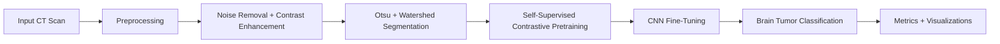

# A Self-Supervised Contrastive Loss Based Pre-Trained Network for Brain Image Classification

Deep learning pipeline for automated brain tumor classification from CT scan images. The project combines medical image preprocessing, Otsu and Watershed segmentation, self-supervised contrastive representation learning, and a CNN classifier built with TensorFlow/Keras.

> Research prototype only. This project is not a clinical diagnostic tool and must not be used for medical decisions without formal validation and expert review.

## Overview

Early brain tumor detection is difficult because symptoms can appear late and manual radiology review is time-consuming. This project explores an automated screening workflow that improves CT image quality, learns tumor-relevant visual representations through self-supervised contrastive learning, and fine-tunes a CNN classifier for brain tumor classification.

The system is aligned with the patent concept: a self-supervised contrastive loss based pre-trained network for brain image classification. It includes preprocessing, feature representation learning, CNN-based classification, tumor-region segmentation, evaluation, and visualization.

## Key Features

- CT image preprocessing with resizing, Gaussian noise removal, CLAHE contrast enhancement, and normalization.
- Automated segmentation using Otsu thresholding and Watershed segmentation for tumor localization support.
- Self-supervised contrastive pretraining inspired by SimCLR/NT-Xent learning.
- CNN encoder and classifier implemented with TensorFlow and Keras.
- Training, validation, testing, prediction, metrics export, confusion matrix, and accuracy/loss visualization.
- Compatible with Python, Visual Studio Code, TensorFlow, Keras, OpenCV, NumPy, Pandas, Matplotlib, and Seaborn.

## Technology Stack

- Python
- TensorFlow / Keras
- OpenCV
- NumPy
- Pandas
- Matplotlib
- Seaborn
- scikit-learn
- Visual Studio Code

## Methodology



## Dataset Structure

Place your CT scan dataset in this format:

```text
data/
  train/
    tumor/
      image_001.png
      image_002.png
    no_tumor/
      image_001.png
      image_002.png
  val/
    tumor/
    no_tumor/
  test/
    tumor/
    no_tumor/
```

Class folder names become class labels automatically. The patent document mentions a large-scale medical imaging dataset source such as The Cancer Imaging Archive; this repository expects the dataset to be prepared locally before training.

## Installation

Create and activate a virtual environment:

```bash
python -m venv .venv
```

Windows:

```bash
.venv\Scripts\activate
```

macOS/Linux:

```bash
source .venv/bin/activate
```

Install dependencies:

```bash
pip install -r requirements.txt
```

## Training

Run the full contrastive pretraining and classifier fine-tuning pipeline:

```bash
python brain_tumor_contrastive_pipeline.py --data-dir data --epochs-pretrain 20 --epochs-finetune 30 --batch-size 32 --image-size 224 --output-dir outputs
```

Useful options:

```bash
python brain_tumor_contrastive_pipeline.py --help
```

Skip contrastive pretraining and train only the classifier:

```bash
python brain_tumor_contrastive_pipeline.py --data-dir data --skip-pretrain --epochs-finetune 30 --output-dir outputs
```

## Prediction

Predict a single CT scan image using a trained model:

```bash
python brain_tumor_contrastive_pipeline.py --predict path/to/ct_scan.png --model outputs/brain_tumor_classifier.keras --output-dir outputs/prediction
```

The prediction command saves:

- Predicted class and confidence in the terminal.
- Segmentation mask.
- Tumor localization overlay.

## Results

The project reported approximately **98.7% training accuracy** during experimentation. Actual performance depends on dataset quality, train/validation/test split, preprocessing choices, class balance, and hardware configuration.

The pipeline writes the following artifacts to `outputs/`:

- `brain_tumor_classifier.keras`
- `class_names.json`
- `training_history.csv`
- `training_curves.png`
- `confusion_matrix.png`
- `classification_report.csv`

Recommended evaluation metrics:

- Accuracy
- Precision
- Recall
- F1-score
- Confusion matrix

## Code Example

The core contrastive loss uses normalized embeddings and cross-entropy over positive image pairs:

```python
def nt_xent_loss(z_i, z_j, temperature=0.1):
    batch_size = tf.shape(z_i)[0]
    z = tf.concat([z_i, z_j], axis=0)
    z = tf.math.l2_normalize(z, axis=1)

    similarity = tf.matmul(z, z, transpose_b=True) / temperature
    large_negative = tf.eye(2 * batch_size) * 1e9
    logits = similarity - large_negative

    labels = tf.concat([
        tf.range(batch_size, 2 * batch_size),
        tf.range(0, batch_size)
    ], axis=0)

    return tf.reduce_mean(
        tf.keras.losses.sparse_categorical_crossentropy(
            labels, logits, from_logits=True
        )
    )
```

The full runnable implementation is available in `brain_tumor_contrastive_pipeline.py`.

## Repository Structure

```text
.
|-- README.md
|-- brain_tumor_contrastive_pipeline.py
|-- requirements.txt
|-- .gitignore
|-- data/
|   |-- train/
|   |-- val/
|   `-- test/
`-- outputs/
```

## Patent-Aligned Summary

The invention relates to artificial intelligence, deep learning, medical imaging, and automated brain tumor classification using CT scan images. The system integrates a preprocessing module, a self-supervised contrastive loss based CNN model, automated image segmentation, and a classification mechanism intended to improve tumor identification accuracy. It is designed to support future integration with cloud-based or on-premises healthcare systems.

## Future Enhancements

- Add Grad-CAM heatmaps for model explainability.
- Add DICOM input support for hospital imaging workflows.
- Add k-fold cross-validation.
- Add Streamlit or Flask interface for demo deployment.
- Validate on external test datasets.
- Package trained model for cloud or edge deployment.

## License

Add your preferred license before publishing the repository.
